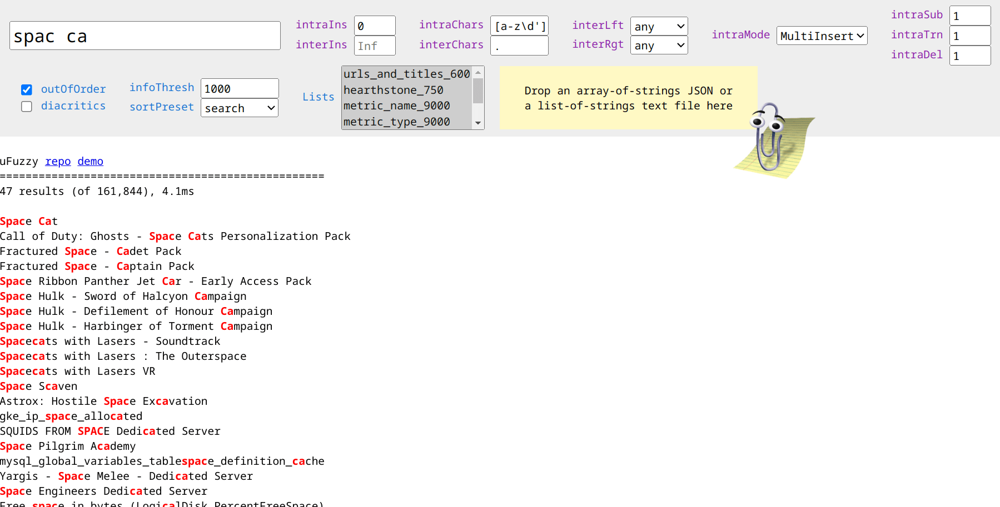
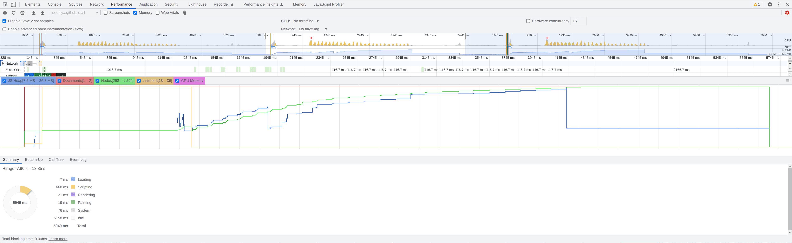

## ▒ μFuzzy

A tiny, efficient fuzzy search that doesn't suck.
This is my fuzzy 🐈. [There are many like it](#a-biased-appraisal-of-similar-work), but this one is mine.[¹](https://en.wikipedia.org/wiki/Rifleman's_Creed#Current_text)

---
### Overview

uFuzzy is a [fuzzy search](https://en.wikipedia.org/wiki/Approximate_string_matching) library designed to match a relatively short search phrase (needle) against a large list of short-to-medium phrases (haystack).
It might be best described as a more forgiving [String.includes()](https://developer.mozilla.org/en-US/docs/Web/JavaScript/Reference/Global_Objects/String/includes).
Common applications include list filtering, auto-complete/suggest, and searches for titles, names, descriptions, filenames, and functions.

In uFuzzy's default `MultiInsert` mode, each match must contain all alpha-numeric characters from the needle in the same sequence;
in `SingleError` mode, single typos are tolerated in each term ([Damerau–Levenshtein distance](https://en.wikipedia.org/wiki/Damerau%E2%80%93Levenshtein_distance) = 1).
Its `.search()` API can efficiently [match out-of-order terms](https://leeoniya.github.io/uFuzzy/demos/compare.html?libs=uFuzzy&outOfOrder&search=spac%20ca), supports multiple substring exclusions (e.g. `fruit -green -melon`), and exact terms with non-alphanum chars (e.g. `"C++"`, `"$100"`, `"#hashtag"`).
When held _just right_, it can efficiently match against multiple object properties, too.

---
### Features

- **Junk-free, high quality results** with any dataset. No need to fine-tune indexing options or boosting params to attain some arbitrary relevance score cut-off.
- **Precise fuzziness control** that follows straightforward rules, without returning unexpected matches.
- **Sorting you can reason about** and customize using a simple `Array.sort()` which gets access to each match's stats/counters. There's no composite, black box "score" to understand.
- **Concise set of options** that don't interact in mysterious ways to drastically alter combined behavior.
- **Fast with low resource usage** - there's no index to build, so startup is below 1ms with near-zero memory overhead. Searching a three-term phrase in a 162,000 phrase dataset takes 5ms with out-of-order terms.
- **Micro, with zero dependencies** - currently [~7.5KB min](https://github.com/leeoniya/uFuzzy/blob/main/dist/uFuzzy.iife.min.js)

[](https://leeoniya.github.io/uFuzzy/demos/compare.html?libs=uFuzzy&outOfOrder&search=spac%20ca)

---
### Charsets, Alphabets, Diacritics

uFuzzy is optimized for the [Latin/Roman alphabet](https://en.wikipedia.org/wiki/Latin_alphabet) and relies internally on non-unicode regular expressions.

Support for more languages works by augmenting the built-in Latin regexps with additional chars or by using the slower, universal `{unicode: true}` variant.
A more simple, but less flexible `{alpha: "..."}` alternative replaces the `A-Z` and `a-z` parts of the built-in Latin regexps with chars of your choice (the letter case will be matched automatically during replacement).

The `uFuzzy.latinize()` util function may be used to strip common accents/diacritics from the haystack and needle prior to searching.

```js
// Latin (default)
let opts = { alpha: "a-z" };
// OR
let opts = {
  // case-sensitive regexps
  interSplit: "[^A-Za-z\\d']+",
  intraSplit: "[a-z][A-Z]",
  intraBound: "[A-Za-z]\\d|\\d[A-Za-z]|[a-z][A-Z]",
  // case-insensitive regexps
  intraChars: "[a-z\\d']",
  intraContr: "'[a-z]{1,2}\\b",
};

// Latin + Norwegian
let opts = { alpha: "a-zæøå" };
// OR
let opts = {
  interSplit: "[^A-Za-zæøåÆØÅ\\d']+",
  intraSplit: "[a-zæøå][A-ZÆØÅ]",
  intraBound: "[A-Za-zæøåÆØÅ]\\d|\\d[A-Za-zæøåÆØÅ]|[a-zæøå][A-ZÆØÅ]",
  intraChars: "[a-zæøå\\d']",
  intraContr: "'[a-zæøå]{1,2}\\b",
};

// Latin + Russian
let opts = { alpha: "a-zа-яё" };
// OR
let opts = {
  interSplit: "[^A-Za-zА-ЯЁа-яё\\d']+",
  intraSplit: "[a-z][A-Z]|[а-яё][А-ЯЁ]",
  intraBound: "[A-Za-zА-ЯЁа-яё]\\d|\\d[A-Za-zА-ЯЁа-яё]|[a-z][A-Z]|[а-яё][А-ЯЁ]",
  intraChars: "[a-zа-яё\\d']",
  intraContr: "'[a-z]{1,2}\\b",
};

// Unicode / universal (50%-75% slower)
let opts = {
  unicode: true,
  interSplit: "[^\\p{L}\\d']+",
  intraSplit: "\\p{Ll}\\p{Lu}",
  intraBound: "\\p{L}\\d|\\d\\p{L}|\\p{Ll}\\p{Lu}",
  intraChars: "[\\p{L}\\d']",
  intraContr: "'\\p{L}{1,2}\\b",
};
```

All searches are currently case-insensitive; it is not possible to do a case-sensitive search.

---
### Demos

**NOTE:** The [testdata.json](https://github.com/leeoniya/uFuzzy/blob/main/demos/testdata.json) file is a diverse 162,000 string/phrase dataset 4MB in size, so first load may be slow due to network transfer.
Try refreshing once it's been cached by your browser.

First, uFuzzy in isolation to demonstrate its performance.

https://leeoniya.github.io/uFuzzy/demos/compare.html?libs=uFuzzy&search=super%20ma

Now the same comparison page, booted with [fuzzysort](https://github.com/farzher/fuzzysort), [QuickScore](https://fwextensions.github.io/quick-score-demo/), and [Fuse.js](https://fusejs.io/):

https://leeoniya.github.io/uFuzzy/demos/compare.html?libs=uFuzzy,fuzzysort,QuickScore,Fuse&search=super%20ma

Here is the full library list but with a reduced dataset (just `hearthstone_750`, `urls_and_titles_600`) to avoid crashing your browser:

https://leeoniya.github.io/uFuzzy/demos/compare.html?lists=hearthstone_750,urls_and_titles_600&search=moo

---
### Questions?

Answers:

- https://news.ycombinator.com/item?id=33035580
- https://old.reddit.com/r/javascript/comments/xtrszc/ufuzzyjs_a_tiny_efficient_fuzzy_search_that/

Else: https://github.com/leeoniya/uFuzzy/issues

---
### Installation

### Node

```
npm i @leeoniya/ufuzzy
```

```js
const uFuzzy = require('@leeoniya/ufuzzy');
```

### Browser

```js
<script src="./dist/uFuzzy.iife.min.js"></script>
```

---
### Example

```js
let haystack = [
    'puzzle',
    'Super Awesome Thing (now with stuff!)',
    'FileName.js',
    '/feeding/the/catPic.jpg',
];

let needle = 'feed cat';

let opts = {};

let uf = new uFuzzy(opts);

// pre-filter
let idxs = uf.filter(haystack, needle);

// idxs can be null when the needle is non-searchable (has no alpha-numeric chars)
if (idxs != null && idxs.length > 0) {
  // sort/rank only when <= 1,000 items
  let infoThresh = 1e3;

  if (idxs.length <= infoThresh) {
    let info = uf.info(idxs, haystack, needle);

    // order is a double-indirection array (a re-order of the passed-in idxs)
    // this allows corresponding info to be grabbed directly by idx, if needed
    let order = uf.sort(info, haystack, needle);

    // render post-filtered & ordered matches
    for (let i = 0; i < order.length; i++) {
      // using info.idx here instead of idxs because uf.info() may have
      // further reduced the initial idxs based on prefix/suffix rules
      console.log(haystack[info.idx[order[i]]]);
    }
  }
  else {
    // render pre-filtered but unordered matches
    for (let i = 0; i < idxs.length; i++) {
      console.log(haystack[idxs[i]]);
    }
  }
}
```

---
### Integrated Search

uFuzzy provides a `uf.search(haystack, needle, outOfOrder = 0, infoThresh = 1e3) => [idxs, info, order]` wrapper which combines the `filter`, `info`, `sort` steps above.
This method also implements efficient logic for matching search terms out of order and support for multiple substring exclusions, e.g. `fruit -green -melon`.

---
### Match Highlighting

Get your ordered matches first:

```js
let haystack = [
  'foo',
  'bar',
  'cowbaz',
];

let needle = 'ba';

let u = new uFuzzy();

let idxs = u.filter(haystack, needle);
let info = u.info(idxs, haystack, needle);
let order = u.sort(info, haystack, needle);
```

Basic innerHTML highlighter (`<mark>`-wrapped ranges):

```js
let innerHTML = '';

for (let i = 0; i < order.length; i++) {
  let infoIdx = order[i];

  innerHTML += uFuzzy.highlight(
    haystack[info.idx[infoIdx]],
    info.ranges[infoIdx],
  ) + '<br>';
}

console.log(innerHTML);
```

innerHTML highlighter with custom marking function (`<b>`-wrapped ranges):

```js
let innerHTML = '';

const mark = (part, matched) => matched ? '<b>' + part + '</b>' : part;

for (let i = 0; i < order.length; i++) {
  let infoIdx = order[i];

  innerHTML += uFuzzy.highlight(
    haystack[info.idx[infoIdx]],
    info.ranges[infoIdx],

    mark,
  ) + '<br>';
}

console.log(innerHTML);
```

DOM/JSX element highlighter with custom marking and append functions:

```js
let domElems = [];

const mark = (part, matched) => {
  let el = matched ? document.createElement('mark') : document.createElement('span');
  el.textContent = part;
  return el;
};

const append = (accum, part) => { accum.push(part); };

for (let i = 0; i < order.length; i++) {
  let infoIdx = order[i];

  let matchEl = document.createElement('div');

  let parts = uFuzzy.highlight(
    haystack[info.idx[infoIdx]],
    info.ranges[infoIdx],

    mark,
    [],
    append,
  );

  matchEl.append(...parts);

  domElems.push(matchEl);
}

document.getElementById('matches').append(...domElems);
```

---
### How It Works

uFuzzy has two operational modes which differ in matching strategy:

- **intraMode: 0** (default) requires all alpha-numeric characters in each search term to exist in the same sequence in all matches. For example, when searching for "**cat**", this mode is capable of matching the strings below. What is _actually_ matched will depend on additonal fuzziness settings.
  - **cat**
  - **c**o**at**
  - s**c**r**at**ch
  - **ca**n**t**ina
  - tra**c**tors **a**re la**t**e
- **intraMode: 1** allows for a single error in each term of the search phrase, where an error is one of: substitution (replacement), transposition (swap), insertion (addition), or deletion (omission). The search strings with errors below can return matches containing "**example**". What is _actually_ matched will depend on additonal fuzziness settings. In contrast to the previous mode, searching for "**example**" will never match "**ex**tr**a** **m**a**ple**".
  - `example` - exact
  - `examplle` - single insertion (addition)
  - `exemple` - single substitution (replacement)
  - `exmaple` - single transposition (swap)
  - `exmple` - single deletion (omission)
  - `xamp` - partial
  - `xmap` - partial with transposition

There are 3 phases to a search:

1. **Filter** filters the full `haystack` with a fast RegExp compiled from your `needle` without doing any extra ops. It returns an array of matched indices in original order.
2. **Info** collects more detailed stats about the filtered matches, such as start offsets, fuzz level, prefix/suffix counters, etc. It also gathers substring match positions for range highlighting. Finally, it filters out any matches that don't conform to the desired prefix/suffix rules. To do all this it re-compiles the `needle` into two more-expensive RegExps that can partition each match. Therefore, it should be run on a reduced subset of the haystack, usually returned by the Filter phase. The [uFuzzy demo](https://leeoniya.github.io/uFuzzy/demos/compare.html?libs=uFuzzy) is gated at <= 1,000 filtered items, before moving ahead with this phase.
3. **Sort** does an `Array.sort()` to determine final result order, utilizing the `info` object returned from the previous phase. A custom sort function can be provided via a uFuzzy option: `{sort: (info, haystack, needle) => idxsOrder}`.

---
### API

A liberally-commented 200 LoC [uFuzzy.d.ts](https://github.com/leeoniya/uFuzzy/blob/main/dist/uFuzzy.d.ts) file.

---
### Options

Options with an **inter** prefix apply to allowances _in between_ search terms, while those with an **intra** prefix apply to allowances _within_ each search term.

<table>
    <thead>
        <tr>
            <th>Option</th>
            <th>Description</th>
            <th>Default</th>
            <th>Examples</th>
        </tr>
    </thead>
    <tbody>
        <tr>
            <td><code>intraMode</code></td>
            <td>How term matching should be performed</td>
            <td><code>0</code></td>
            <td>
                <code>0</code> MultiInsert<br>
                <code>1</code> SingleError<br><br>
                See <a href="#how-it-works">How It Works</a>
            </td>
        </tr>
        <tr>
            <td><code>intraIns</code></td>
            <td>Max number of extra chars allowed<br>between each char within a term</td>
            <td>Matches the value of <code>intraMode</code> (either <code>0</code> or <code>1</code>)</td>
            <td>
                Searching "cat"...<br>
                <code>0</code> can match: <b>cat</b>, s<b>cat</b>, <b>cat</b>ch, va<b>cat</b>e<br>
                <code>1</code> also matches: <b>ca</b>r<b>t</b>, <b>c</b>h<b>a</b>p<b>t</b>er, out<b>ca</b>s<b>t</b><br>
            </td>
        </tr>
        <tr>
            <td><code>interIns</code></td>
            <td>Max number of extra chars allowed between terms</td>
            <td><code>Infinity</code></td>
            <td>
                Searching "where is"...<br>
                <code>Infinity</code> can match: <b>where is</b>, <b>where</b> have blah w<b>is</b>dom<br>
                <code>5</code> cannot match: where have blah wisdom<br>
            </td>
        </tr>
        <tr>
            <td>
                <code>intraSub</code><br>
                <code>intraTrn</code><br>
                <code>intraDel</code><br>
            </td>
            <td>
                For <code>intraMode: 1</code> only,<br>
                Error types to tolerate within terms
            </td>
            <td>Matches the value of <code>intraMode</code> (either <code>0</code> or <code>1</code>)</td>
            <td>
                <code>0</code> No<br>
                <code>1</code> Yes<br>
            </td>
        </tr>
        <tr>
            <td><code>intraChars</code></td>
            <td>Partial regexp for allowed insert<br>chars between each char within a term</td>
            <td><code>[a-z\d']</code></td>
            <td>
                <code>[a-z\d]</code> matches only alpha-numeric (case-insensitive)<br>
                <code>[\w-]</code> would match alpha-numeric, undercore, and hyphen<br>
            </td>
        </tr>
        <tr>
            <td><code>intraFilt</code></td>
            <td>Callback for excluding results based on term &amp; match</td>
            <td><code>(term, match, index) => true</code></td>
            <td>
                Do your own thing, maybe...
                - Length diff threshold<br>
                - Levenshtein distance<br>
                - Term offset or content<br>
            </td>
        </tr>
        <tr>
            <td><code>interChars</code></td>
            <td>Partial regexp for allowed chars between terms</td>
            <td><code>.</code></td>
            <td>
                <code>.</code> matches all chars<br>
                <code>[^a-z\d]</code> would only match whitespace and punctuation<br>
            </td>
        </tr>
        <tr>
            <td><code>interLft</code></td>
            <td>Determines allowable term left boundary</td>
            <td><code>0</code></td>
            <td>
                Searching "mania"...<br>
                <code>0</code> any - anywhere: ro<b>mania</b>n<br>
                <code>1</code> loose - whitespace, punctuation, alpha-num, case-change transitions: Track<b>Mania</b>, <b>mania</b>c<br>
                <code>2</code> strict - whitespace, punctuation: <b>mania</b>cally<br>
            </td>
        </tr>
        <tr>
            <td><code>interRgt</code></td>
            <td>Determines allowable term right boundary</td>
            <td><code>0</code></td>
            <td>
                Searching "mania"...<br>
                <code>0</code> any - anywhere: ro<b>mania</b>n<br>
                <code>1</code> loose - whitespace, punctuation, alpha-num, case-change transitions: <b>Mania</b>Star<br>
                <code>2</code> strict - whitespace, punctuation: <b>mania</b>_foo<br>
            </td>
        </tr>
        <tr>
            <td><code>sort</code></td>
            <td>Custom result sorting function</td>
            <td><code>(info, haystack, needle) => idxsOrder</code></td>
            <td>
                Default: <a href="https://github.com/leeoniya/uFuzzy/blob/bba02537334ae9d02440b86262fbfa40d86daa54/src/uFuzzy.js#L32-L52">Search sort</a>, prioritizes full term matches and char density<br>
                Demo: <a href="https://github.com/leeoniya/uFuzzy/blob/bba02537334ae9d02440b86262fbfa40d86daa54/demos/compare.html#L264-L288">Typeahead sort</a>, prioritizes start offset and match length<br>
            </td>
        </tr>
    </tbody>
</table>

---
### A biased appraisal of similar work

This assessment is extremely narrow and, of course, biased towards my use cases, text corpus, and my complete expertise in operating my own library.
It is highly probable that I'm not taking full advantage of some feature in other libraries that may significantly improve outcomes along some axis;
I welcome improvement PRs from anyone with deeper library knowledge than afforded by my hasty 10min skim over any "Basic usage" example and README doc.

#### Search quality

Can-of-worms #1.

Before we discuss [performance](#performance) let's talk about search quality, because speed is irrelevant when your results are a strange medly of "Oh yeah!" and "WTF?".

Search quality is very subjective.
What constitutes a good top match in a "typeahead / auto-suggest" case can be a poor match in a "search / find-all" scenario.
Some solutions optimize for the latter, some for the former.
It's common to find knobs that skew the results in either direction, but these are often by-feel and imperfect, being little more than a proxy to producing a single, composite match "score".

Let's take a look at some matches produced by the most popular fuzzy search library, [Fuse.js](https://github.com/krisk/Fuse) and some others for which match highlighting is implemented in the demo.

Searching for the partial term **"twili"**, we see these results appearing above numerous obvious **"twilight"** results:

https://leeoniya.github.io/uFuzzy/demos/compare.html?libs=uFuzzy,fuzzysort,QuickScore,Fuse&search=twili

- **twi**r**li**ng
- **T**he total number of received alerts that **w**ere **i**nva**li**d.
- **T**om Clancy's Ghost Recon **Wil**dlands - AS**I**A Pre-order Standard Uplay Activation
- **t**heHunter™: Call of the **Wi**ld - Bearclaw **Li**te CB-60

Not only are these poor matches in isolation, but they actually rank higher than literal substrings.

Finishing the search term to **"twilight"**, _still_ scores bizzare results higher:

https://leeoniya.github.io/uFuzzy/demos/compare.html?libs=uFuzzy,fuzzysort,QuickScore,Fuse&search=twilight

- Magic: **T**he Gathering - Duels of the Planeswalkers **Wi**ngs of **Light** Unlock
- **T**he **Wil**d E**ight**

Some engines do better with partial prefix matches, at the expense of higher startup/indexing cost:

https://leeoniya.github.io/uFuzzy/demos/compare.html?libs=uFuzzy,FlexSearch,match-sorter,MiniSearch&search=twili

Here, `match-sorter` returns 1,384 results, but only the first 40 are relevant. How do we know where the cut-off is?

<!--
twil  0.1683 ok, 0.25+ bad
chest 0.1959 ok, 0.2+ bad
train
nin tur
puzz, puzl (MiniSearch, {fuzzy: 0.4}, uFuzzy, intraIns: 1)
-->

#### Performance

Can-of-worms #2.

All benchmarks suck, but this one might suck more than others.

- I've tried to follow any "best performance" advice when I could find it in each library's docs, but it's a certainty that some stones were left unturned when implementing ~20 different search engines.
- Despite my best efforts, result quality is still extremely variable between libraries, and even between search terms. In some cases, results are very poor but the library is very fast; in other cases, the results are better, but the library is quite slow. What use is extreme speed when the search quality is sub-par? This is a subjective, nuanced topic that will surely affect how you interpret these numbers. I consider uFuzzy's search quality second-to-none, so my view of most faster libraries is typically one of quality trade-offs I'm happy not to have made. I encourage you to evaluate the results for all benched search phrases manually to decide this for yourself.
- Many fulltext & document-search libraries compared here are designed to work best with exact terms rather than partial matches (which this benchmark is skewed towards).

Still, something is better than a hand-wavy YMMV/do-it-yourself dismissal and certainly better than nothing.

#### Benchmark

**Environment**

<table>
  <tr>
    <th>Date</th>
    <td>2023-10</td>
  </tr>
  <tr>
    <th>Hardware</th>
    <td>
      CPU: <a href="https://www.amd.com/en/products/apu/amd-ryzen-7-pro-5850u">Ryzen 7 PRO 5850U</a> (1.9GHz, 7nm, 15W TDP)<br>
      RAM: 48GB<br>
      SSD: Samsung SSD 980 PRO 1TB (NVMe)<br>
    </td>
  </tr>
  <tr>
    <th>OS</th>
    <td>EndeavourOS (Arch Linux)<br>v6.5.4-arch2-1 x86_64</td>
  </tr>
  <tr>
    <th>Chrome</th>
    <td>v117.0.5938.132</td>
  </tr>
</table>

- Each benchmark can be run by changing the `libs` parameter to the desired library name: https://leeoniya.github.io/uFuzzy/demos/compare.html?bench&libs=uFuzzy
- Results output is suppressed in `bench` mode to avoid benchmarking the DOM.
- Measurements are taken in the Performance secrion of Chrome's DevTools by recording several reloads of the bench page, with forced garbage collection in between. The middle/typical run is used to collect numbers.
- The search corpus is 162,000 words and phrases, loaded from a 4MB [testdata.json](https://github.com/leeoniya/uFuzzy/blob/main/demos/testdata.json).
- The benchmark types and then deletes, character-by-character (every 20ms) the following search terms, triggering a search for each keypress: `test`, `chest`, `super ma`, `mania`, `puzz`, `prom rem stor`, `twil`.

To evaluate the results for each library, or to compare several, simply visit the same page with more `libs` and without `bench`: https://leeoniya.github.io/uFuzzy/demos/compare.html?libs=uFuzzy,fuzzysort,QuickScore,Fuse&search=super%20ma.



There are several metrics evaluated:

- Init time - how long it takes to load the library and build any required index to perform searching.
- Bench runtime - how long it takes to execute all searches.
- Memory required - peak JS heap size used during the bench as well as how much is still retained after a forced garbage collection at the end.
- GC cost - how much time is needed to collect garbage at the end (main thread jank)

<!--
https://bestofjs.org/projects?tags=search
-->

<table>
    <thead>
        <tr>
            <th>Lib</th>
            <th>Stars</th>
            <th>Size (min)</th>
            <th>Init</th>
            <th>Search<br>(x 86)</th>
            <th>Heap (peak)</th>
            <th>Retained</th>
            <th>GC</th>
        </tr>
    </thead>
    <tbody>
        <tr>
            <td>
                <a href="https://github.com/leeoniya/uFuzzy">uFuzzy</a>
                (<a href="https://leeoniya.github.io/uFuzzy/demos/compare.html?libs=uFuzzy&search=super%20ma">try</a>)
            </td>
            <td>★ 2.3k</td>
            <td>7.6KB</td>
            <td>0.5ms</td>
            <td>434ms</td>
            <td>28.4MB</td>
            <td>7.4MB</td>
            <td>18ms</td>
        </tr>
        <tr>
            <td>
                <a href="https://github.com/leeoniya/uFuzzy">uFuzzy</a>
                (<a href="https://leeoniya.github.io/uFuzzy/demos/compare.html?libs=uFuzzy&prefixCache&search=super%20ma">try</a>)<br>
                (external prefix caching)
            </td>
            <td></td>
            <td></td>
            <td></td>
            <td>210ms</td>
            <td>27.8MB</td>
            <td>7.4MB</td>
            <td>18ms</td>
        </tr>
        <tr>
            <td>
                <a href="https://github.com/leeoniya/uFuzzy">uFuzzy</a>
                (<a href="https://leeoniya.github.io/uFuzzy/demos/compare.html?libs=uFuzzy&intraIns=1&intraChars=[a-z\d%27%20]&outOfOrder&search=super%20ma">try</a>)<br>
                (outOfOrder, fuzzier)
            </td>
            <td></td>
            <td></td>
            <td></td>
            <td>545ms</td>
            <td>29.5MB</td>
            <td>7.4MB</td>
            <td>18ms</td>
        </tr>
        <tr>
            <td>
                <a href="https://github.com/leeoniya/uFuzzy">uFuzzy</a>
                (<a href="https://leeoniya.github.io/uFuzzy/demos/compare.html?libs=uFuzzy&intraMode=1&intraIns=1&intraChars=[a-z\d%27%20]&outOfOrder&search=super%20ma">try</a>)<br>
                (outOfOrder, fuzzier, SingleError)
            </td>
            <td></td>
            <td></td>
            <td></td>
            <td>508ms</td>
            <td>30.0MB</td>
            <td>7.4MB</td>
            <td>18ms</td>
        </tr>
        <tr>
            <th colspan="8">-------</th>
        </th>
        <tr>
            <td>
                <a href="https://github.com/krisk/Fuse">Fuse.js</a>
                (<a href="https://leeoniya.github.io/uFuzzy/demos/compare.html?libs=Fuse&search=super%20ma">try</a>)
            </td>
            <td>★ 16.6k</td>
            <td>24.2KB</td>
            <td>31ms</td>
            <td>33875ms</td>
            <td>245MB</td>
            <td>13.9MB</td>
            <td>25ms</td>
        </tr>
        <tr>
            <td>
                <a href="https://github.com/nextapps-de/flexsearch">FlexSearch (Light)</a>
                (<a href="https://leeoniya.github.io/uFuzzy/demos/compare.html?libs=FlexSearch&search=super%20ma">try</a>)
            </td>
            <td>★ 10.7k</td>
            <td>6.2KB</td>
            <td>3210ms</td>
            <td>83ms</td>
            <td>670MB</td>
            <td>316MB</td>
            <td>553ms</td>
        </tr>
        <tr>
            <td>
                <a href="https://github.com/olivernn/lunr.js">Lunr.js</a>
                (<a href="https://leeoniya.github.io/uFuzzy/demos/compare.html?libs=Lunr&search=super%20ma">try</a>)
            </td>
            <td>★ 8.7k</td>
            <td>29.4KB</td>
            <td>1704ms</td>
            <td>996ms</td>
            <td>380MB</td>
            <td>123MB</td>
            <td>166ms</td>
        </tr>
        <tr>
            <td>
                <a href="https://github.com/oramasearch/orama">Orama (formerly Lyra)</a>
                (<a href="https://leeoniya.github.io/uFuzzy/demos/compare.html?libs=Orama&search=super%20ma">try</a>)
            </td>
            <td>★ 6.4k</td>
            <td>41.5KB</td>
            <td>2650ms</td>
            <td>225ms</td>
            <td>313MB</td>
            <td>192MB</td>
            <td>180ms</td>
        </tr>
        <tr>
            <td>
                <a href="https://github.com/lucaong/minisearch">MiniSearch</a>
                (<a href="https://leeoniya.github.io/uFuzzy/demos/compare.html?libs=MiniSearch&search=super%20ma">try</a>)
            </td>
            <td>★ 3.4k</td>
            <td>29.1KB</td>
            <td>504ms</td>
            <td>1453ms</td>
            <td>438MB</td>
            <td>67MB</td>
            <td>105ms</td>
        </tr>
        <tr>
            <td>
                <a href="https://github.com/kentcdodds/match-sorter">match-sorter</a>
                (<a href="https://leeoniya.github.io/uFuzzy/demos/compare.html?libs=match-sorter&search=super%20ma">try</a>)
            </td>
            <td>★ 3.4k</td>
            <td>7.3KB</td>
            <td>0.1ms</td>
            <td>6245ms</td>
            <td>71MB</td>
            <td>7.3MB</td>
            <td>12ms</td>
        </tr>
        <tr>
            <td>
                <a href="https://github.com/farzher/fuzzysort">fuzzysort</a>
                (<a href="https://leeoniya.github.io/uFuzzy/demos/compare.html?libs=fuzzysort&search=super%20ma">try</a>)
            </td>
            <td>★ 3.4k</td>
            <td>6.2KB</td>
            <td>50ms</td>
            <td>1321ms</td>
            <td>175MB</td>
            <td>84MB</td>
            <td>63ms</td>
        </tr>
        <tr>
            <td>
                <a href="https://github.com/kbrsh/wade">Wade</a>
                (<a href="https://leeoniya.github.io/uFuzzy/demos/compare.html?libs=Wade&search=super%20ma">try</a>)
            </td>
            <td>★ 3k</td>
            <td>4KB</td>
            <td>781ms</td>
            <td>194ms</td>
            <td>438MB</td>
            <td>42MB</td>
            <td>130ms</td>
        </tr>
        <tr>
            <td>
                <a href="https://github.com/bevacqua/fuzzysearch">fuzzysearch</a>
                (<a href="https://leeoniya.github.io/uFuzzy/demos/compare.html?libs=fuzzysearch&search=super%20ma">try</a>)
            </td>
            <td>★ 2.7k</td>
            <td>0.2KB</td>
            <td>0.1ms</td>
            <td>529ms</td>
            <td>26.2MB</td>
            <td>7.3MB</td>
            <td>18ms</td>
        </tr>
        <tr>
            <td>
                <a href="https://github.com/bvaughn/js-search">js-search</a>
                (<a href="https://leeoniya.github.io/uFuzzy/demos/compare.html?libs=js-search&search=super%20ma">try</a>)
            </td>
            <td>★ 2.1k</td>
            <td>17.1KB</td>
            <td>5620ms</td>
            <td>1190ms</td>
            <td>1740MB</td>
            <td>734MB</td>
            <td>2600ms</td>
        </tr>
        <tr>
            <td>
                <a href="https://github.com/weixsong/elasticlunr.js">Elasticlunr.js</a>
                (<a href="https://leeoniya.github.io/uFuzzy/demos/compare.html?libs=Elasticlunr&search=super%20ma">try</a>)
            </td>
            <td>★ 2k</td>
            <td>18.1KB</td>
            <td>933ms</td>
            <td>1330ms</td>
            <td>196MB</td>
            <td>70MB</td>
            <td>135ms</td>
        </tr>
        <tr>
            <td>
                <a href="https://github.com/Glench/fuzzyset.js">Fuzzyset</a>
                (<a href="https://leeoniya.github.io/uFuzzy/demos/compare.html?libs=Fuzzyset&search=super%20ma">try</a>)
            </td>
            <td>★ 1.4k</td>
            <td>2.8KB</td>
            <td>2962ms</td>
            <td>606ms</td>
            <td>654MB</td>
            <td>238MB</td>
            <td>239ms</td>
        </tr>
        <tr>
            <td>
                <a href="https://github.com/fergiemcdowall/search-index">search-index</a>
                (<a href="https://leeoniya.github.io/uFuzzy/demos/compare.html?libs=search-index&search=super%20ma">try</a>)
            </td>
            <td>★ 1.4k</td>
            <td>168KB</td>
            <td colspan="5">RangeError: Maximum call stack size exceeded</td>
        </tr>
        <tr>
            <td>
                <a href="https://github.com/brianreavis/sifter.js">sifter.js</a>
                (<a href="https://leeoniya.github.io/uFuzzy/demos/compare.html?libs=sifter&search=super%20ma">try</a>)
            </td>
            <td>★ 1.1k</td>
            <td>7.5KB</td>
            <td>3ms</td>
            <td>1070ms</td>
            <td>46.2MB</td>
            <td>10.6MB</td>
            <td>18ms</td>
        </tr>
        <tr>
            <td>
                <a href="https://github.com/ajitid/fzf-for-js">fzf-for-js</a>
                (<a href="https://leeoniya.github.io/uFuzzy/demos/compare.html?libs=fzf-for-js&search=super%20ma">try</a>)
            </td>
            <td>★ 831</td>
            <td>15.4KB</td>
            <td>50ms</td>
            <td>6290ms</td>
            <td>153MB</td>
            <td>25MB</td>
            <td>18ms</td>
        </tr>
        <tr>
            <td>
                <a href="https://github.com/mattyork/fuzzy">fuzzy</a>
                (<a href="https://leeoniya.github.io/uFuzzy/demos/compare.html?libs=fuzzy&search=super%20ma">try</a>)
            </td>
            <td>★ 819</td>
            <td>1.4KB</td>
            <td>0.1ms</td>
            <td>5427ms</td>
            <td>72MB</td>
            <td>7.3MB</td>
            <td>14ms</td>
        </tr>
        <tr>
            <td>
                <a href="https://github.com/EthanRutherford/fast-fuzzy">fast-fuzzy</a>
                (<a href="https://leeoniya.github.io/uFuzzy/demos/compare.html?libs=fast-fuzzy&search=super%20ma">try</a>)
            </td>
            <td>★ 346</td>
            <td>18.2KB</td>
            <td>790ms</td>
            <td>19266ms</td>
            <td>550MB</td>
            <td>165MB</td>
            <td>140ms</td>
        </tr>
        <tr>
            <td>
                <a href="https://github.com/itemsapi/itemsjs">ItemsJS</a>
                (<a href="https://leeoniya.github.io/uFuzzy/demos/compare.html?libs=ItemsJS&search=super%20ma">try</a>)
            </td>
            <td>★ 305</td>
            <td>109KB</td>
            <td>2400ms</td>
            <td>11304ms</td>
            <td>320MB</td>
            <td>88MB</td>
            <td>163ms</td>
        </tr>
        <tr>
            <td>
                <a href="https://github.com/rmm5t/liquidmetal">LiquidMetal</a>
                (<a href="https://leeoniya.github.io/uFuzzy/demos/compare.html?libs=LiquidMetal&search=super%20ma">try</a>)
            </td>
            <td>★ 292</td>
            <td>4.2KB</td>
            <td colspan="5">(crash)</td>
        </tr>
        <tr>
            <td>
                <a href="https://github.com/wouter2203/fuzzy-search">FuzzySearch</a>
                (<a href="https://leeoniya.github.io/uFuzzy/demos/compare.html?libs=FuzzySearch&search=super%20ma">try</a>)
            </td>
            <td>★ 209</td>
            <td>3.5KB</td>
            <td>2ms</td>
            <td>3948ms</td>
            <td>84MB</td>
            <td>10.5MB</td>
            <td>18ms</td>
        </tr>
        <tr>
            <td>
                <a href="https://github.com/jeancroy/FuzzySearch">FuzzySearch2</a>
                (<a href="https://leeoniya.github.io/uFuzzy/demos/compare.html?libs=FuzzySearch2&search=super%20ma">try</a>)
            </td>
            <td>★ 186</td>
            <td>19.4KB</td>
            <td>93ms</td>
            <td>4189ms</td>
            <td>117MB</td>
            <td>40.3MB</td>
            <td>40ms</td>
        </tr>
        <tr>
            <td>
                <a href="https://github.com/fwextensions/quick-score">QuickScore</a>
                (<a href="https://leeoniya.github.io/uFuzzy/demos/compare.html?libs=QuickScore&search=super%20ma">try</a>)
            </td>
            <td>★ 153</td>
            <td>9.5KB</td>
            <td>10ms</td>
            <td>6915ms</td>
            <td>133MB</td>
            <td>12.1MB</td>
            <td>18ms</td>
        </tr>
        <tr>
            <td>
                <a href="https://github.com/localvoid/ndx">ndx</a>
                (<a href="https://leeoniya.github.io/uFuzzy/demos/compare.html?libs=ndx&search=super%20ma">try</a>)
            </td>
            <td>★ 142</td>
            <td>2.9KB</td>
            <td>300ms</td>
            <td>581ms</td>
            <td>308MB</td>
            <td>137MB</td>
            <td>262ms</td>
        </tr>
        <tr>
            <td>
                <a href="https://github.com/jhawthorn/fzy.js/">fzy</a>
                (<a href="https://leeoniya.github.io/uFuzzy/demos/compare.html?libs=fzy&search=super%20ma">try</a>)
            </td>
            <td>★ 133</td>
            <td>1.5KB</td>
            <td>0.1ms</td>
            <td>3932ms</td>
            <td>34MB</td>
            <td>7.3MB</td>
            <td>10ms</td>
        </tr>
        <tr>
            <td>
                <a href="https://github.com/axules/fuzzy-tools">fuzzy-tools</a>
                (<a href="https://leeoniya.github.io/uFuzzy/demos/compare.html?libs=fuzzy-tools&search=super%20ma">try</a>)
            </td>
            <td>★ 13</td>
            <td>3KB</td>
            <td>0.1ms</td>
            <td>5138ms</td>
            <td>164MB</td>
            <td>7.5MB</td>
            <td>18ms</td>
        </tr>
        <tr>
            <td>
                <a href="https://github.com/grafana/grafana/blob/main/packages/grafana-ui/src/utils/fuzzy.ts">fuzzyMatch</a>
                (<a href="https://leeoniya.github.io/uFuzzy/demos/compare.html?libs=fuzzyMatch&search=super%20ma">try</a>)
            </td>
            <td>★ 0</td>
            <td>1KB</td>
            <td>0.1ms</td>
            <td>2415ms</td>
            <td>83.5MB</td>
            <td>7.3MB</td>
            <td>13ms</td>
        </tr>
    </tbody>
</table>
